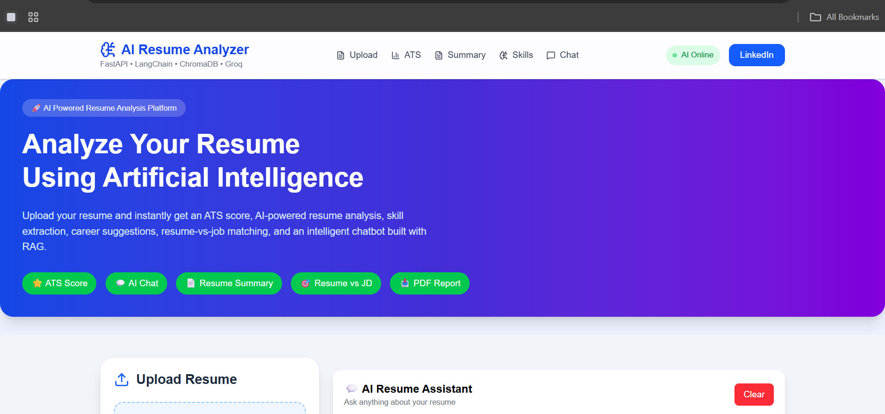
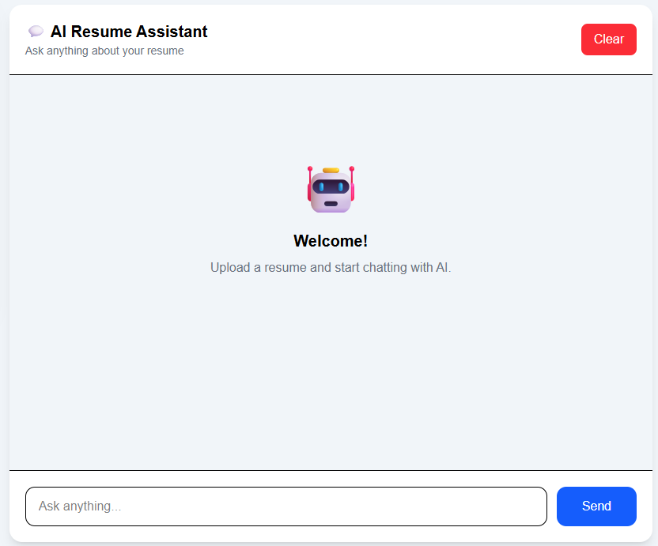
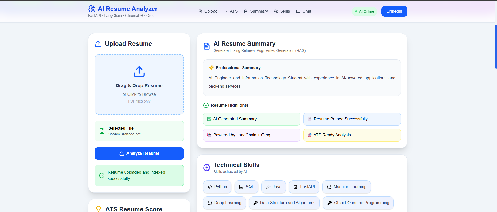
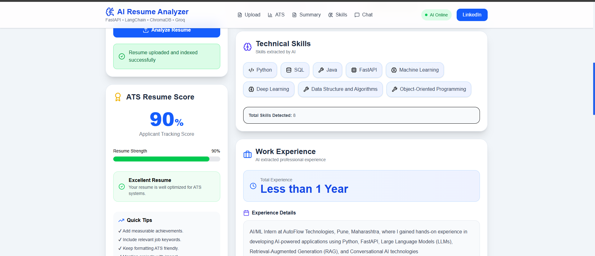
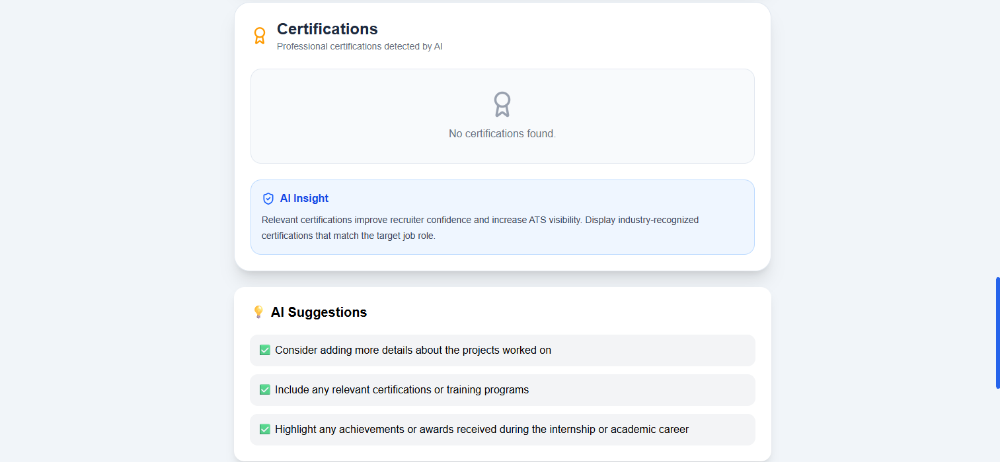

# 🤖 AI Resume Analyzer

> An AI-powered Resume Analyzer built with **FastAPI, React, LangChain, ChromaDB, Hugging Face Embeddings, and Groq LLM** that provides ATS analysis, resume insights, AI chat, job matching, skill gap analysis, and PDF report generation.

---

## 📌 Features

✅ Resume Upload (PDF)

✅ ATS Resume Score

✅ Professional Resume Summary

✅ Skills Extraction

✅ Experience Analysis

✅ Education Detection

✅ Certifications Detection

✅ AI Resume Chat (RAG)

✅ Job Match Analysis

✅ Skill Gap Analysis

✅ PDF Report Generation

✅ Modern Responsive UI

---

# 🚀 Tech Stack

### Frontend

- React.js
- Vite
- Tailwind CSS
- Axios

### Backend

- FastAPI
- Python
- LangChain
- ChromaDB
- HuggingFace Embeddings
- Groq LLM

### AI Technologies

- RAG (Retrieval-Augmented Generation)
- Vector Database
- Sentence Transformers
- Llama 3.3 70B
- Prompt Engineering

---

# 📂 Project Structure

```
AI-Resume-Analyzer
│
├── backend
│   ├── app
│   │   ├── routes
│   │   ├── services
│   │   ├── prompts
│   │   ├── uploads
│   │   ├── chroma_db
│   │   └── utils
│   │
│   ├── requirements.txt
│   └── .env.example
│
├── frontend
│   ├── src
│   │   ├── components
│   │   ├── pages
│   │   ├── services
│   │   └── styles
│   │
│   ├── package.json
│   └── vite.config.js
│
└── README.md
```

---

# ⚙️ Installation

## 1️⃣ Clone Repository

```bash
git clone https://github.com/rajmahadikrm/AI-Resume-Analyzer.git

cd AI-Resume-Analyzer
```

---

## 2️⃣ Backend Setup

```bash
cd backend

python -m venv .venv
```

Activate Virtual Environment

### Windows

```bash
.venv\Scripts\activate
```

### Linux / Mac

```bash
source .venv/bin/activate
```

Install Dependencies

```bash
pip install -r requirements.txt
```

---

## 3️⃣ Create Environment Variable

Create a file

```
.env
```

Add

```env
GROQ_API_KEY=YOUR_GROQ_API_KEY
```

---

## 4️⃣ Run Backend

```bash
uvicorn app.main:app --reload
```

Backend URL

```
http://127.0.0.1:8000
```

Swagger

```
http://127.0.0.1:8000/docs
```

---

## 5️⃣ Frontend Setup

```bash
cd frontend

npm install
```

Run

```bash
npm run dev
```

Frontend

```
http://localhost:5173
```

---

# 📊 Application Workflow

```
Upload Resume
        │
        ▼
Extract Text from PDF
        │
        ▼
Create Chunks
        │
        ▼
Generate Embeddings
        │
        ▼
Store in ChromaDB
        │
        ▼
LangChain Retriever
        │
        ▼
Groq LLM
        │
        ▼
Resume Analysis
```

---

# 📸 Screenshots

### Dashboard



---

### AI Chat



---

### UPLOAD RESUME




---

### ATS Score



---

### AI Suggesion



---

### Education


---

# ⭐ Future Improvements

- Authentication
- Resume History
- Multiple Resume Comparison
- Multi-language Support
- Cloud Deployment
- AI Interview Preparation
- Resume Recommendation Engine

---

# 👨‍💻 Author

**RAJ MAHADIK**

GitHub

https://github.com/rajmahadikrm

LinkedIn

www.linkedin.com/in/rajmahadik


!!!    T H A N K    Y O U      !!!